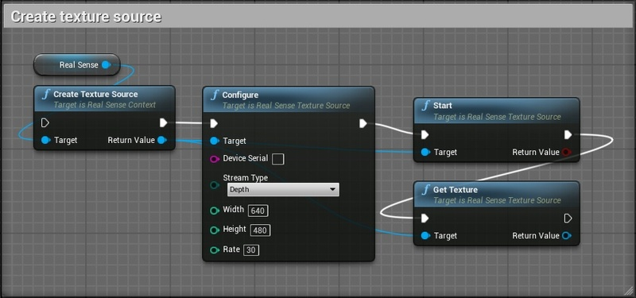

# UnrealEngine4 Wrapper for Intel RealSense SDK

UnrealEngine4 wrapper allows to use Intel RealSense SDK features via Blueprints. At the moment it provides functionality to enumerate/configure/control hardware and render live sensor data to textures.

## Getting Started

Download and install [RealSense SDK 2.0](https://github.com/IntelRealSense/librealsense/releases)

Copy `realsense2.dll` to engine bin folder: `C:\Program Files\Epic Games\UE_4.19\Engine\Binaries\Win64\`

Download wrapper files and configure SDK path:
* edit file `RealSense-UE4-Wrapper\Plugins\RealSense\Source\RealSense\RealSense.Build.cs`
* update line `string RealSenseDirectory = "REALSENSE_SDK_PATH_HERE"`

Generate project files for `RealSenseUE.uproject`

Build `RealSenseUE.sln` using `DevelopmentEditor` configuration

Start and play `RealSenseUE.uproject` to see some live data

Check `TextureStreamActor` blueprint for more details

## Core features

The core wrapper object `RealSenseContext` can be acquired calling `GetRealSense` function:

Use `RealSenseContext -> QueryDevices` to get available devices:

Use `RealSenseDevice -> QuerySensors` to get device sensors (Color/Depth/Infrared):

Use `RealSenseSensor -> QueryOptions` to get sensor options. Depending on hardware some options may not be available.

## Texture source

Live data from any sensor can be rendered to texture using `RealSenseTextureSource`. It created via `RealSenseContext -> CreateTextureSource`:

